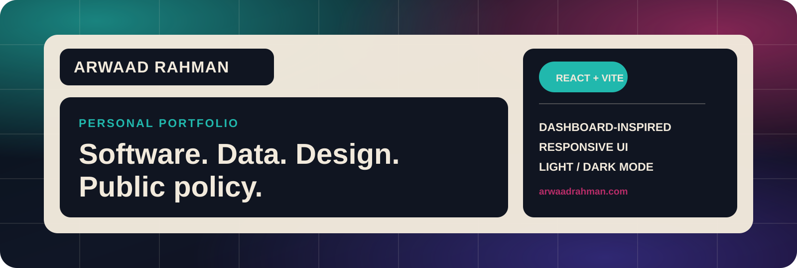

# Arwaad Rahman — Personal Portfolio

A dashboard-inspired personal portfolio for presenting my work across software, data, design, and public policy.

**Live site:** https://arwaadrahman.com

## About the project

I built this portfolio as an alternative to a conventional scrolling developer site. The interface is organized around dashboard-style tiles, project states, responsive navigation, and a visual language influenced by sports-game menus and information-dense UI.

The goal is to make the site feel personal and interactive while still giving visitors a clear path to my projects, coursework, background, and contact information.

## Highlights

- Dashboard-style homepage with featured work and a rotating personal snapshot
- Dedicated project, coursework, and about routes using React Router
- Responsive desktop, tablet, and mobile navigation
- Light and dark themes
- Animated background effects and custom cursor interactions
- Project status system for work that is completed, active, or still planned
- Vercel Analytics integration
- Sitemap and robots configuration for basic discoverability

## Tech stack

- **React 19**
- **React Router**
- **Vite**
- **CSS**
- **Vercel Analytics**
- **ESLint**

## Project structure

```text
src/
├── components/   # Shared interface components and homepage sections
├── data/         # Project, coursework, and current-rotation content
├── pages/        # Route-level pages
├── App.jsx       # Application shell, routes, theme, and modal state
└── App.css       # Global visual system and responsive styling

public/            # Static assets, resume, favicon, sitemap, and robots.txt
```

## Run locally

```bash
npm install
npm run dev
```

For a production build:

```bash
npm run build
npm run preview
```

## Design direction

The visual direction evolved through several iterations before settling on the current dashboard interface. I wanted the site to feel less like a template and more like a personal system: strong tile hierarchy, compact navigation, clear status labels, and motion that adds personality without becoming the main content.

The site is still evolving as I complete more substantive projects. Planned work is labeled explicitly so the portfolio distinguishes between what exists now and what is still in development.

## Current status

The core portfolio experience is live. I am continuing to refine accessibility, performance, project case studies, and content as new work is completed.

## Contact

- **Portfolio:** https://arwaadrahman.com
- **GitHub:** https://github.com/arwaadrahman
- **LinkedIn:** https://www.linkedin.com/in/arwaad/
